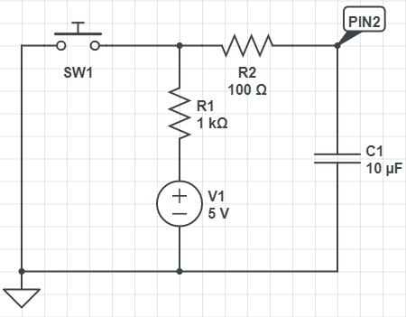

# 8 LED Blink Patterns using 74HC595 Serial-to-Parallel Converter

This is a simple project that turns 8 LEDs on and off using one of a set of pre-defined patterns.  It uses the 74HC595 Serial-to-Parallel Converter Integrated Circuit (IC) to minimize the number of input/output pins on the  Arduino microcontroller required to drive the 8 LEDs.

The patterns are defind in the [src/pattern](src/pattern) subdirectory.  Each one inherits from the `IPattern` interface defined in [PatternBase.h](src/pattern/PatternBase.h).  Most patterns derive from an abstract subclass named `InMemPatternBase` defined in the same file.  Patterns based on that subclass are required to define an array of `PatternDelay` struct instances.

```C++
struct PatternDelay
{
	byte Pattern;
	int Delay;
};
```

Each bit of the `Pattern` byte specifies whether the corresponding LED should be on or off.  The `Delay` int defines how long to display the pattern before moving on to the next one.

## Switch Debounce Circuit

Pin 2 of the Arduino is connected to a normally-open (NO) momentary switch, which is used to trigger an Interrupt Service Routine (ISR) when taken low.  This causes the main program to switch to the next pattern.

When a switch is closed, its contacts tend to bounce (rapidly connect and disconnect), which will cause the ISR to execute multiple times.  The simple circuit below prevents this by slowing down the transitions from high to low and low to high.



The capacitor C1 must be charged before the voltage at PIN2 will be high.  The resistors R1 and R2 slow down the rate of charge.  When the switch is closed, the R2 resistor slows the rate of discharge.  This filters the undesirable, transient bouncing signal, resulting in the ISR running only once (instead of multiple times) each time the button is pressed.
